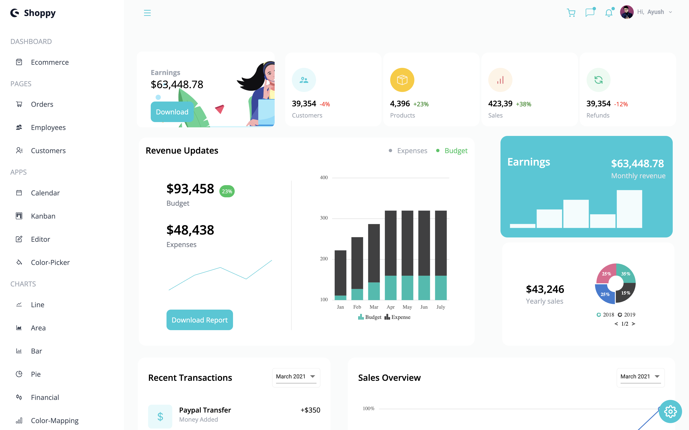
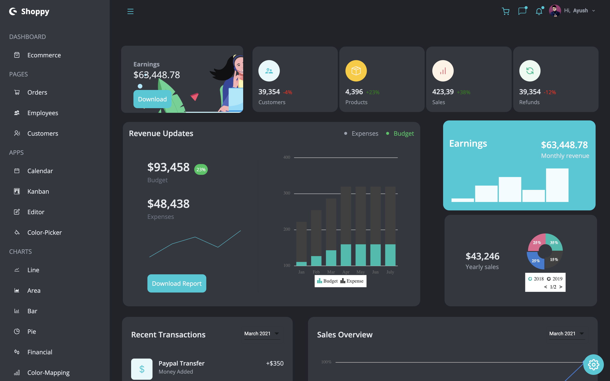

# <a href="https://admin-dashboard-r.vercel.app/">SHOPPY</a>

### `Admin Dashboard.`
<br>
</img>
<br>
<br>
</img>

<!-- <a href="https://www.youtube.com/watch?v=rJpA7ulK2rQ" target="_blank" >
 
</a> -->

<!-- <br> -->

<hr>
<hr>


# Project Description

This is a Admin Dashboard which is fully mobile responsive and customizable.
User can choose between six different theme colors as well as can toggle between light and dark theme mode.
This Admin Panel includes one dashboard, 3 pages, 4 apps, and 7 fully functional charts. <br>
The pages include features like `pagination`, `searching`, `filtering`,`editing`, and `deleting` of the content.<br>
The Apps included in this application are `Calendar`, `Kanban board`, `Editor`, and `Color Picker`. These apps are fully functional with drag-and-drop feature, editable content, and much more.

<br>

<hr>
<hr>

# Technologies Used


<br>
<hr>
<hr>

<!-- <br> -->

# Set Up

### Clone the repo.

```
git clone https://github.com/${GitHub Username}/admin_dashboard.git
```

<br>

### Open Terminal on the Folder

```
cd admin_dashboard
```

<br>

### Install the Dependencies

```
npm install
```

<br>

### Run the UI

```
npm run dev
or
yarn start
```

<br>
<hr>
